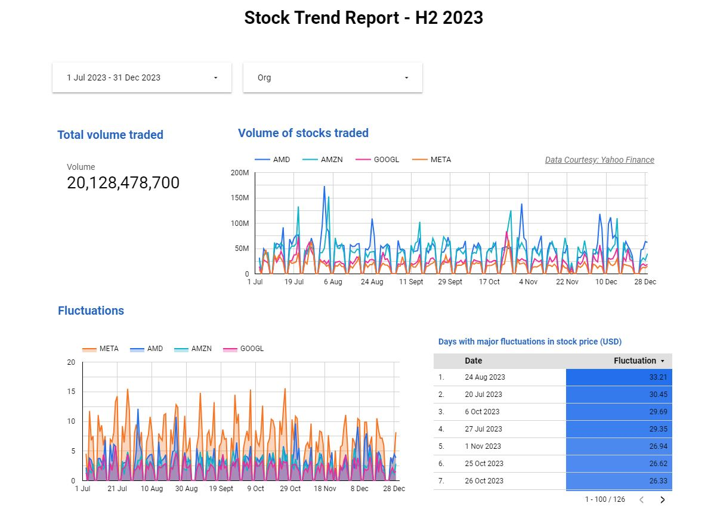

## Data Engineering Zoomcamp 2024 

## Course Project
American Stock Exchange - Stock Market Data Pipeline

## Objective
Build a data pipeline that can perform ETL to data warehouse hosted on Cloud platform and generate insights on large cap companies' common stocks traded on American Stock Exchange. Billions of trades occur on a daily basis in American Stock Exchange. In order to generate valuable insights from this data and enable data driven decision making, it is important to engineer this process by building data pipelines and dashboards. This project demonstrates batch processing approach. 

### Tools used
- Terraform - To deploy infrastructure on GCS and Bigquery
- Docker - To containerize data pipeline scripts
- Spark - To perform data transformations 
- GCS - Data lake used for processing
- Bigquery - Data warehouse to store data
- Looker Studio - Buils reports and derive insights form the data loaded

### Pre-requisites
1. Create a GCP account
2. Create a project in GCP
3. Create a service account for the project that has IAM access set up for GCS, Bigquery, Dataproc
4. Create keys and download the JSON file to your work folder 
5. Copy all the scripts listed below your work folder
  - [main.tf](../main.tf)
  - [variables.tf](../variables.tf)
  - [yf_file_extraction.py](../yf_file_extraction.py)
  - [yf_web_to_gcs.py](../yf_web_to_gcs.py)
  - [yf_csv_to_parquet.py](../yf_csv_to_parquet.py)
  - [yf_parquet_to_bigquery.py](../yf_parquet_to_bigquery.py)
  - [Dockerfile_file_extraction](../Dockerfile_file_extraction)
  - [Dockerfile_web_to_gcs](../Dockerfile_web_to_gcs)

### Step 1 - Deploy infrastructure
Deploy google cloud services such as GCS and Bigquery which will be used in this project. 
Amend credentials, project, region to align to your GCP account in variables.tf file.

tf files - main.tf, variables.tf

Execute commands to deploy the infrastructure
1. terraform init
2. terraform plan
3. terraform apply

### Step 2 - Data extraction
YahooFinance API is used to extract common stocks traded on ASE. 
This data pipeline takes time period and company name as arguments. 

- Docker image - Dockerfile_file_extraction
- Data pipeline script - yf_file_extraction.py

Sample Docker image build & run commands (rename Dockerfile_file_extraction to Dockerfile)
- docker build -t yf:pandas .
- docker run -it yf:pandas --year=2023 --file=AMD
- docker run -it yf:pandas --year=2023 --file=AMZN
- docker run -it yf:pandas --year=2023 --file=GOOGL
- docker run -it yf:pandas --year=2023 --file=META

Alternate (if not using Docker)
- python yf_file_extraction.py \
    --year=2023 \
    --file=META

### Step 3 - Upload to GCS
Upload csv files to Google Cloud Storage for further processing. 
This data pipeline takes time period and company name as arguments. 

- Docker image - Dockerfile_web_to_gcs
- Data pipeline script - yf_web_to_gcs.py

Sample Docker image build & run commands (rename Dockerfile_web_to_gcs to Dockerfile)
- docker build -t yf:gcs .
- docker run -it yf:gcs --year=2023 --file=AMD
- docker run -it yf:gcs --year=2023 --file=AMZN
- docker run -it yf:gcs --year=2023 --file=GOOGL
- docker run -it yf:gcs --year=2023 --file=META

Alternate (if not using Docker)
- python yf_web_to_gcs.py \
    --year=2023 \
    --file=META

### Step 4 - csv to parquet
Convert csv files to parquet format in GCS for optimized data processing

- Data pipeline script - yf_csv_to_parquet.py

Execute
- gsutil -m cp yf_csv_to_parquet.py gs://dataenggzoomcamp_proj_yf/code/yf_csv_to_parquet.py

- gcloud dataproc jobs submit pyspark \
    --cluster=de-zoomcamp-cluster-yf \
    --region=us-west1 \
    gs://dataenggzoomcamp_proj_yf/code/yf_csv_to_parquet.py \
    -- \
        --year=2023 \
        --file=META

(**repeat for AMD, AMZN, GOOGL)

### Step 5 - parquet to Bigquery
Perform data transformations in spark and load the results to Bigquery table 

- Data pipeline script - yf_parquet_to_bigquery.py

Execute
- gsutil -m cp yf_parquet_to_bigquery.py gs://dataenggzoomcamp_proj_yf/code/yf_parquet_to_bigquery.py

- gcloud dataproc jobs submit pyspark \
    --cluster=de-zoomcamp-cluster-yf \
    --region=us-west1 \
    --jars=gs://spark-lib/bigquery/spark-bigquery-latest_2.12.jar \
    gs://dataenggzoomcamp_proj_yf/code/yf_parquet_to_bigquery.py \
    -- \
        --year=2023 \
        --input=gs://dataenggzoomcamp_proj_yf/pq \
        --output=yf.report2023

- create or replace table `dltdemo.yf.report2023_prt` 
partition by Date 
cluster by Org as 
(select * from dltdemo.yf.report2023); 

### Step 6 - Build dashboard using LookerStudio

